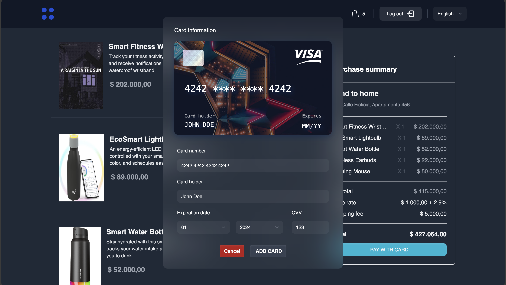

<p align="center">
  <a href="https://github.com/soyvillareal/yellow-first/actions/workflows/prod.yml"></a>
  <a href="https://codecov.io/github/soyvillareal/yellow-first/branch/main/graph/badge.svg"></a>
  <a href="https://github.com/jestjs/jest/blob/main/LICENSE"></a>
</p>

## Tabla de contenido:

- [Diagrama UML](#diagrama-uml)
- [Instrucciones para iniciar con Docker](#instrucciones-para-iniciar-con-docker)
  - [Paso 1](#paso-1)
  - [Paso 2](#paso-2)
- [Vistas previas del proyecto](#vistas-previas-del-proyecto)
  - [1. Inicio](#1-inicio)
  - [2. Reportes](#2-reportes)
  - [3. Movimientos](#3-movimientos)
  - [4. Nuevo movimiento](#4-nuevo-movimiento)
  - [5. Usuarios](#5-usuarios)
  - [6. Editar usuario](#6-editar-usuario)

# Diagrama UML


# Instrucciones para iniciar con Docker

### Paso 1

Usted debe asegurarse de que tiene las siguientes variables disponibles para el Backend (dentro del directorio) y con los valores adecuados.

```bash
# Time zone of the server
TZ='America/Bogota'
# The maximum size of the body of the request
BODY_LIMIT=50mb
# The maximum size of the file that can be uploaded
PORT_APP=4001
# Allows the server to receive requests from any origin
CORS_ORIGIN='*'
# Database type
DB_TYPE=postgres
# Database host
DB_HOST=localhost
# Database port
DB_PORT=5432
# Database user
DB_USER=postgres
# Database password
DB_PASSWORD=
# Database name
DB_NAME=red_first
# The value of the secret key for the JWT token
JWT_SECRET_KEY=jwtExample
# When the JWT token expires
JWT_EXPIRES_IN=6h
# The url suffix for the swagger documentation
SWAGGER_SUFFIX=/docs
# The username to access the swagger documentation
SWAGGER_USERNAME=yellowfirst
# The password to access the swagger documentation
SWAGGER_PASSWORD=123456
# URL of the gateway API
API_GATEWAY=https://example.dev/v1
# Public key of the gateway API
PUBLIC_KEY=pub_stagtest_EXAMPLE
# Private key of the gateway API
PRIVATE_KEY=prv_stagtest_EXAMPLE
# The key to access the gateway API
INTEGRITY_KEY=stagtest_integrity_EXAMPLE
# The key to access the gateway API
EVENTS_KEY=stagtest_events_EXAMPLE
```

### Paso 2

```bash
# Instalar paquetes en el backend
cd backend
npm i

# Instalar paquetes en el frontend
cd frontend
npm i

# Regrese al directorio raíz
cd ..

# Copie sus cariables de entorno (Revise el paso 1)
echo "#Variables para el backend" > ./.env && cat ./backend/.env.local >> ./.env && echo "\n#Variables para el frontend" >> ./.env && cat ./frontend/.env.local >> ./.env

# Levante los contenedores de docker
docker compose up -d

# Ejecute las migraciones para el Backend
cd backend
npm run migrations:run:local

# Ejecute los seeders para el Backend
npm run seed:run:local
```

## Vistas previas del proyecto

### 1. Inicio


### 2. Inicio de sesión


### 3. Carrito


### 4. Información de la tarjeta



### 5. Estado de la transacción

